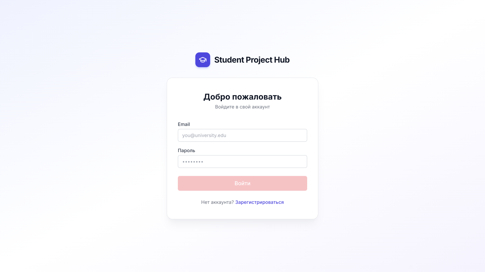
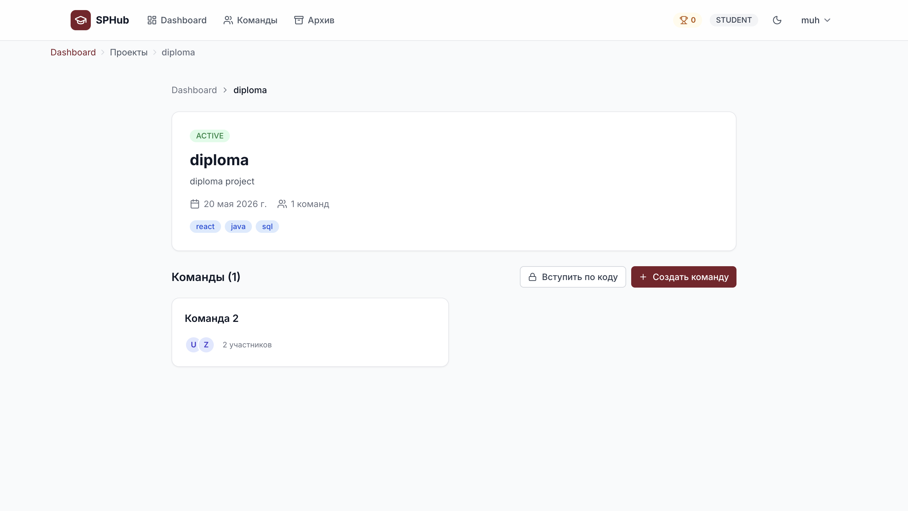
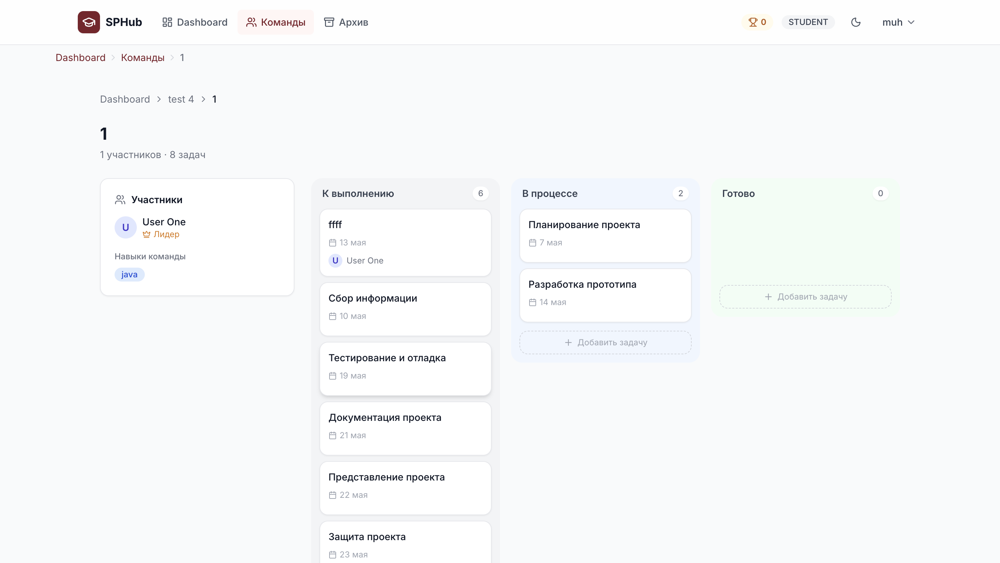
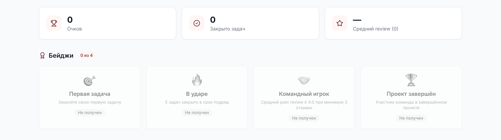
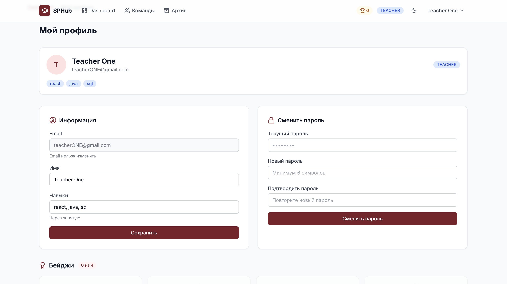
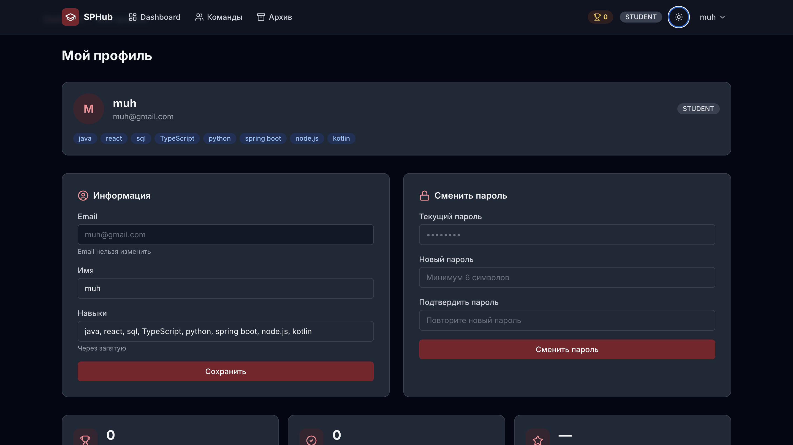

# Student Project Hub

> Collaboration platform for student teams: project management, peer assessment, AI-assisted planning, and gamification.

[]()
[]()
[]()
[]()

A full-stack web application that helps student teams plan, track, and evaluate group projects in one place — replacing the typical mix of group chats, spreadsheets, and lost deadlines.

## Why I built this

Group projects in higher education tend to fall apart in predictable ways: communication gets fragmented across chats, work distribution is unclear, deadlines slip, and contribution is hard to assess fairly. Existing tools (Trello, Notion, Jira) solve parts of this but aren't built around the academic workflow — semesters, peer review, skill-based team formation.

I built Student Project Hub to explore what a focused, opinionated project management tool for student teams could look like, and to get hands-on experience integrating modern AI APIs into a real-world workflow.

---

## Features

### Project & team management
- **Role-based access** — Student / Teacher / Admin with route-level guards
- **Kanban board** with drag-and-drop task management (`@dnd-kit`)
- **Team formation** via shareable invite codes
- **Project lifecycle** — Active / Completed / Archived states with separate archive view
- **Deadline tracking** with overdue indicators

### Smart features
- **AI Roadmap Generator** — uses Groq's Llama 3.3 70B to break a project description into 5–8 actionable subtasks. Originally built on Gemini API, migrated to Groq after hitting regional free-tier restrictions.
- **Skill matching** — Jaccard similarity between user skill tags and project requirements; recommends projects to students and suggests team composition to teachers
- **LMS deadline import** — parses `.ics` calendar files (RFC 5545) for compatibility with Canvas, Moodle, Google Classroom

### Collaboration & evaluation
- **Anonymous peer review** with 1–5 rating + comments; aggregated view for teachers
- **Gamification** — points and 4 types of badges (First Task, On Fire, Team Player, Project Done)

### UX
- Dark mode with system preference detection
- Skeleton loaders for perceived performance
- Breadcrumbs for navigation
- Page transitions with Framer Motion

---

## Screenshots

| Login | Student Dashboard |
|-------|-------------------|
|  | .png) |

| Project page | Kanban board |
|--------------|--------------|
|  |  |

| AI Roadmap Generator | Gamification |
|----------------------|-------------|
|  | 
 |

| Profile with gamification | Dark mode |
|---------------------------|-----------|
|  |  |

---

## Tech stack

### Frontend
- **Next.js 14** (App Router) — chosen over Vite+React for built-in routing, server components, and zero-config TypeScript
- **TypeScript** in strict mode
- **Tailwind CSS** for styling
- **@dnd-kit** for accessible drag-and-drop (preferred over `react-beautiful-dnd` due to better React 18 support)
- **Framer Motion** for page transitions
- **axios** with JWT interceptor
- **react-hot-toast**, **lucide-react**

### Backend
- **Node.js + Express + TypeScript** — chose Node over Spring Boot for faster iteration and a single language across the stack
- **Prisma ORM** — type-safe queries with auto-generated TypeScript types from the schema
- **PostgreSQL 16** — relational model fits the domain (users ↔ projects ↔ teams ↔ tasks) better than a document store
- **JWT** + **bcrypt** for auth
- **zod** for runtime validation at API boundaries
- **multer** + **node-ical** for `.ics` import

### AI
- **Groq API** (Llama 3.3 70B) — picked for its free tier availability in my region and sub-second response times. Drop-in replacement for Gemini after running into regional quota issues.

### Infrastructure
- **Docker Compose** for local PostgreSQL
- Environment-based config via `.env` files

---

## Architecture

Standard 3-tier architecture with clear separation between presentation, business logic, and data layers.

┌─────────────────────────────────────────────────────────┐
│  Presentation                                            │
│  Next.js (App Router) · React · Tailwind                 │
└──────────────────┬──────────────────────────────────────┘
│ REST + JWT
┌──────────────────▼──────────────────────────────────────┐
│  Application                                             │
│  Express · TypeScript · zod                              │
│  ├─ Controllers (auth, projects, teams, tasks, ...)      │
│  ├─ Services (AI, gamification, ICS-parser)              │
│  ├─ Middleware (requireAuth, requireRole, validate)      │
│  └─ External: Groq API                                   │
└──────────────────┬──────────────────────────────────────┘
│ Prisma ORM
┌──────────────────▼──────────────────────────────────────┐
│  Data                                                    │
│  PostgreSQL 16                                           │
└─────────────────────────────────────────────────────────┘

### Project layout

student-project-hub/
├── backend/
│   ├── src/
│   │   ├── controllers/    # Route handlers
│   │   ├── services/       # Business logic, AI integration
│   │   ├── middleware/     # Auth, validation, file upload
│   │   ├── routes/         # Express route definitions
│   │   ├── utils/          # Helpers (Jaccard, JWT, invite code generator)
│   │   └── server.ts       # Entry point
│   └── prisma/
│       ├── schema.prisma
│       └── migrations/
├── frontend/
│   └── src/
│       ├── app/            # Next.js App Router pages
│       │   ├── (auth)/     # /login, /register
│       │   └── (app)/      # /dashboard, /teams, /projects, /profile, /archive
│       ├── components/     # Reusable UI + feature components
│       ├── hooks/          # useAuth
│       ├── lib/            # axios, theme, auth helpers
│       └── types/
└── docker-compose.yml

---

## Engineering decisions

A few non-obvious choices worth calling out:

**Why Node.js, not Spring Boot?** The original architecture spec called for Spring Boot, but for an MVP, the boilerplate cost outweighed the benefits. Single-language stack (TS everywhere) made context-switching cheaper and the type definitions flow cleanly from Prisma schema to API to UI.

**Why Prisma, not raw SQL or TypeORM?** Prisma's generated types eliminated an entire class of runtime errors. The migration tooling is also significantly better than alternatives.

**Why Groq, not Gemini or OpenAI?** Started on Gemini, which works excellently — but its free tier has quota=0 in some regions (including mine). Migrated to Groq's free tier (30 req/min, 14,400 req/day on Llama 3.3 70B), which is more than enough for this use case and runs an order of magnitude faster than most alternatives.

**Why Jaccard for skill matching, not embeddings?** Embeddings would be more semantically rich, but require either an external API call per recommendation or hosting a model. Jaccard similarity over normalized skill tags works well at small scale and is fully self-contained. Trade-off: explicitly requires teachers/students to use consistent tag names.

**Why .ics for LMS integration, not direct OAuth?** OAuth integrations with Canvas/Moodle require partner accounts and lengthy approval. The `.ics` standard (RFC 5545) is exported by all major LMS platforms and gives 90% of the value with 10% of the integration work.

**Why JWT, not sessions?** Stateless auth simplifies deployment (no shared session store), and the security model is sufficient for this use case. Tokens are short-lived (7 days) and stored in `localStorage` with a CSRF-resistant API design.

---

## Getting started

### Prerequisites

- Node.js 20+
- Docker Desktop
- A free Groq API key from [console.groq.com](https://console.groq.com/keys)

### 1. Clone and start the database

```bash
git clone https://github.com/<your-github-username>/student-project-hub.git
cd student-project-hub
docker compose up -d
```

### 2. Backend

```bash
cd backend
npm install
cp .env.example .env
# Fill in JWT_SECRET and GROQ_API_KEY in .env
npx prisma migrate deploy
npx prisma generate
npm run dev
```

API runs on `http://localhost:4000`.

### 3. Frontend

```bash
cd frontend
npm install
cp .env.local.example .env.local
npm run dev
```

App runs on `http://localhost:3000`.

---

## Environment variables

### `backend/.env`

| Variable | Description |
|---|---|
| `DATABASE_URL` | PostgreSQL connection string |
| `JWT_SECRET` | Random string for signing tokens (use `openssl rand -hex 32`) |
| `PORT` | API port (default 4000) |
| `GROQ_API_KEY` | Groq API key from console.groq.com |

### `frontend/.env.local`

| Variable | Description |
|---|---|
| `NEXT_PUBLIC_API_URL` | Backend URL (default `http://localhost:4000/api`) |

---

## API overview

The backend exposes ~20 REST endpoints across the following resources:

- **Auth** — register, login, profile, password change
- **Projects** — CRUD with role-based authorization, status management
- **Teams** — creation, invite-code join, member management
- **Tasks** — CRUD with team-membership checks, status transitions trigger gamification
- **Reviews** — peer review submission, aggregated view for teachers
- **AI Roadmap** — generation via Groq, import as tasks
- **Recommendations** — skill-based project/team suggestions
- **ICS Import** — parse calendar files into tasks

Full route list and request/response schemas: see [`backend/src/routes/`](backend/src/routes/).

---

## Database schema

Core entities and relationships:

- `User` (`id`, `fullName`, `email`, `password`, `role`, `skills[]`, `points`, `badges[]`)
- `Project` (`id`, `title`, `deadline`, `status`, `requiredSkills[]`, `createdById → User`)
- `Team` (`id`, `name`, `inviteCode`, `projectId → Project`, `leaderId → User`)
- `TeamMember` (composite key: `teamId`, `userId`)
- `Task` (`id`, `title`, `status`, `deadline`, `teamId → Team`, `assigneeId → User?`)
- `PeerReview` (`projectId`, `reviewerId`, `targetUserId`, `score`, `comment`) — unique constraint on (project, reviewer, target)
- `AIRoadmap` (`projectId`, `generatedSteps: Json`)

Full schema: [`backend/prisma/schema.prisma`](backend/prisma/schema.prisma).

---

## What's next

Things I'd add given more time:

- **Real-time collaboration** — currently uses optimistic UI updates + refetch on focus. WebSocket via Socket.io would be the natural next step for multiplayer Kanban editing.
- **Direct LMS integration** — OAuth flows with Canvas/Moodle would replace the `.ics` import for institutions that use them.
- **Email/Push notifications** — for upcoming deadlines, peer review prompts, task assignments.
- **Embeddings-based skill matching** — replace Jaccard with vector similarity for fuzzier matching (e.g., "React" ≈ "ReactJS" ≈ "React.js").
- **Mobile app** — React Native or Flutter, sharing the same backend.
- **Predictive analytics** — based on task completion patterns and peer review scores, flag at-risk students earlier.

---

## Author

**Mukhammed Tungyshbay**

- GitHub: [@<your-github-username>](https://github.com/ummvvaa)
- LinkedIn: [linkedin.com/in/<your-linkedin>](https://www.linkedin.com/in/mukhammed-tungyshbai-80aa78398/)

If you have questions about the project or just want to chat, feel free to reach out.

---

## License

MIT — feel free to use, modify, and learn from this project.